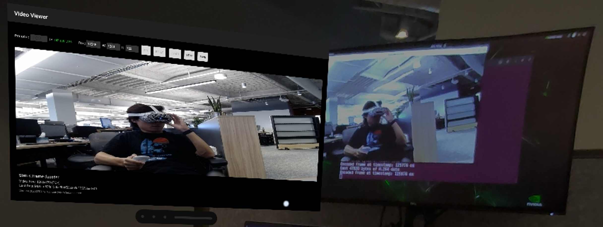

# XRoboToolkit-Orin-Video-Sender
Video Previewer/Encoder/Sender on Nvidia Jetson Orin Platform


> Sender (Webcam): `./OrinVideoSender --preview --send --server 192.168.1.176 --port 12345`

> Receiver (Video-Viewer): TCP - 192.168.1.176 - 12345 - 1280x720

## Features

- Support Webcam and ZED cameras
- Preview
- H264 Encoding (via GStreamer)
- TCP/UDP sending w/ and w/o ASIO


## How to

- Setup necessary environment on Orin

- Build
```
# Update `Makefile` to choose the protocol [TCP/UDP], camera type [Webcam/ZED], w/ or w/o ASIO.
# Default: TCP w/o asio.

# install zmq
sudo apt-get install libzmq3-dev

make

./OrinVideoSender --help

# Listen to coming command from VR, 192.168.1.153 is the Orin IP address
# Add `--preview` to show the video on Orin if necessary 
./OrinVideoSender --listen 192.168.1.153:13579

# send the video stream to both VR via TCP and my own ubuntu via ZMQ
./OrinVideoSender --listen 192.168.1.153:13579 --zmq tcp://*:5555

# Direct send the video stream # 192.168.1.176 is the VR headset IP
# Add `--preview` to show the video on Orin if necessary 
./OrinVideoSender --send --server 192.168.1.176 --port 12345
```

## One More Thing 

- For software encoding ffmpeg, please refer to [RobotVisionTest](https://github.com/XR-Robotics/RobotVision-PC/tree/main/VideoTransferPC/RobotVisionTest).

> Note: Hardware ffmpeg encoding is not availalbe yet.

> Note: Jetson Multimedia API is not in use yet.

- For encoded h264 stream receiver, please refer to [VideoPlayer](https://github.com/XR-Robotics/RobotVision-PC/tree/main/VideoTransferPC/VideoPlayer) [TCP Only].

- For a general video player, please refer to [Video-Viewer](https://github.com/XR-Robotics/XRoboToolkit-Native-Video-Viewer) [TCP/UDP].

- The encoded h264 stream can be also played in [Unity-Client](https://github.com/XR-Robotics/XRoboToolkit-Unity-Client) [TCP Only].
